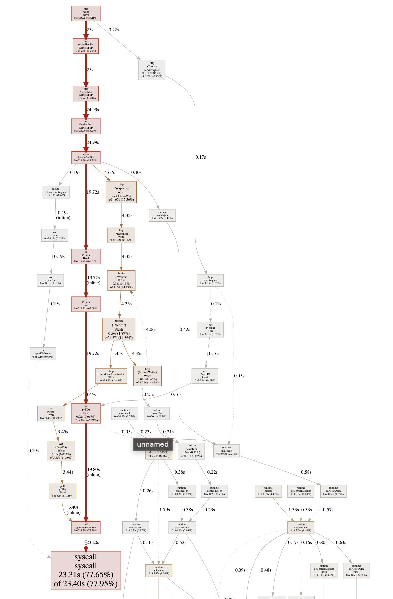
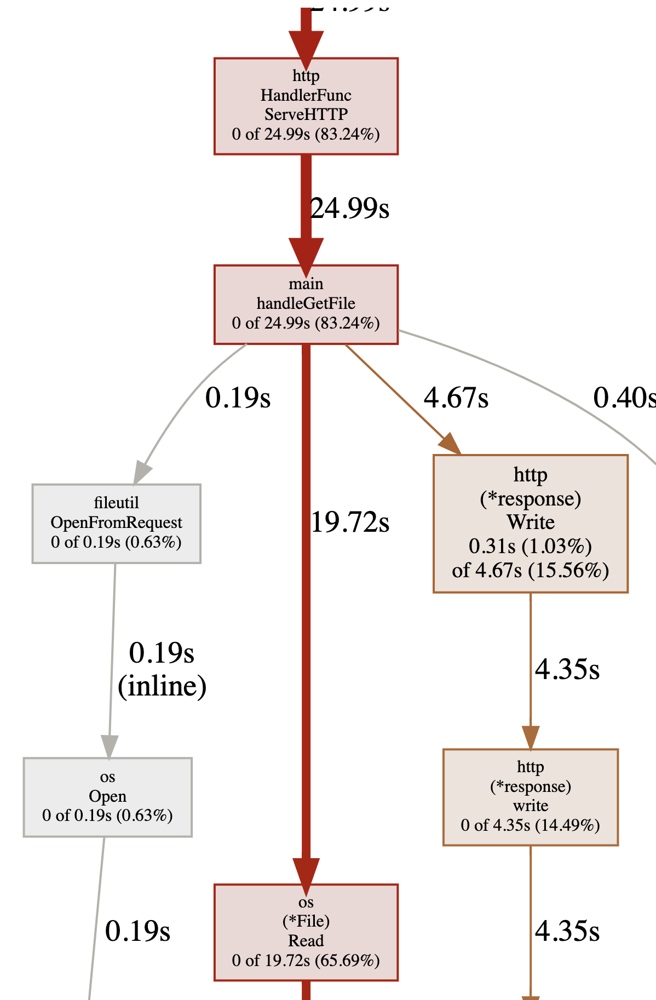
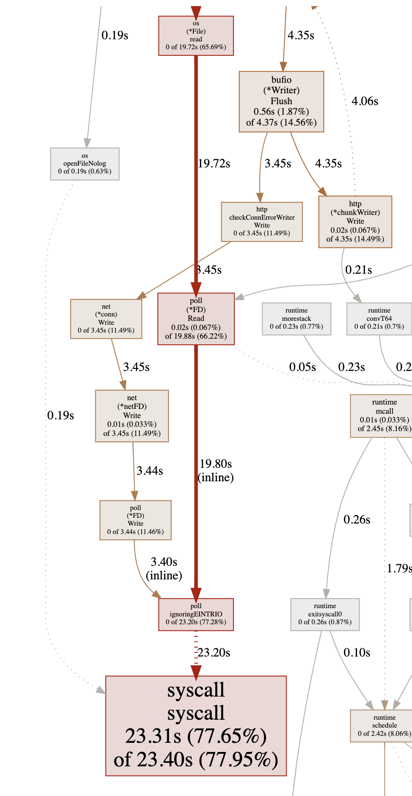
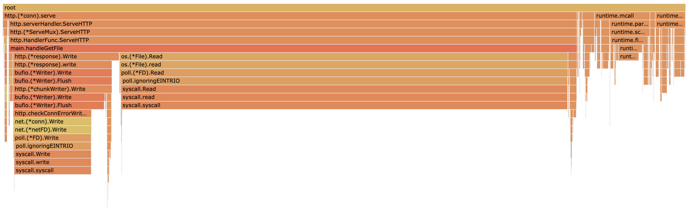
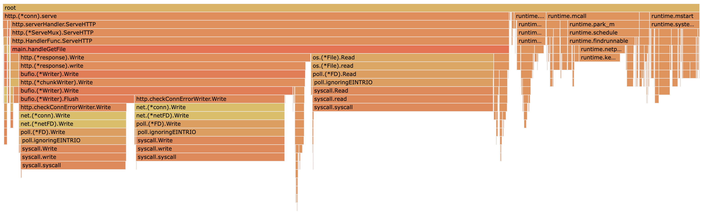

# Demo Flow - Step 2

[prev](../step1/README.md) | [next](../step3/README.md)

## Collect CPU profiling data

Make sure the server is still running in terminal 1 with `pprof` endpoints enabled, otherwise - start it.

Run the benchmark and collect the CPU profile
1. In terminal 2 - run the benchmark
   ```
   wrk -t100 -d7s -c100 http://localhost:8000/file/test-1mb 
   ```
2. In terminal 3 - run the `pprof` tool to collect CPU profile from the server for 5 seconds and open the browser with the results.  
   ```
   go tool pprof -http : http://localhost:8000/debug/pprof/profile?seconds=5
   ```
Or do both in one command:
```
wrk -t100 -d7s -c100 http://localhost:8000/file/test-1mb & sleep 1 && go tool pprof -http : http://localhost:8000/debug/pprof/profile?seconds=5
```

### Graph View



Zoom in...

 

You can see that reading the file takes the majority of the time. 
Looking further - it is the `syscall` that takes the time.

### Flame Graph View

Same information in a different type of visualization - the [flame graph](http://www.brendangregg.com/flamegraphs.html):



## Analysis and Improvement

When file reading spends a lot of CPU time on `syscall.Read` it usually doesn't mean the `syscall` is slow, but that it is being called many times.

To mitigate it we can increase the buffer size we use for the file reading. Currently it is 1K, let's increase it to 10K.
(note- there's a tradeoff, increasing the buffer size impacts memory consumption, remember - this is a profiling demo...)

So now the read byte buffer is defined as:
```go
var b [1024 * 10]byte
```

Run the benchmark again and collect the CPU profile. The throughput should increase - on my laptop it was `~700 req/sec`, and now it is `~1,100 req/sec`.

The flame graph now shows a different picture:


