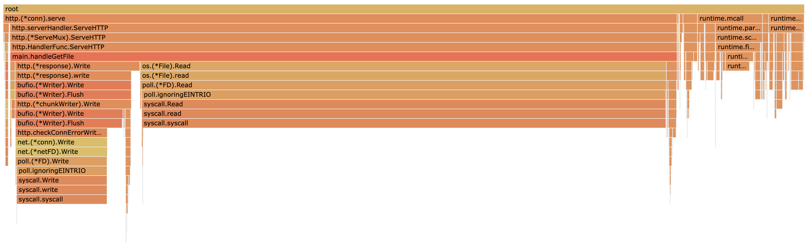

# Demo Flow - Step 2

[prev](../step1/README.md) | [next](../step3/README.md)

## Collect CPU profiling data

Make sure the server is still running in terminal 1 with `pprof` endpoints enabled, otherwise - start it.

Run the benchmark and collect the CPU profile
1. In terminal 2 - run the benchmark
   ```
   wrk -t100 -d7s -c100 http://localhost:8000/file/test-1mb 
   ```
2. In terminal 3 - run the `pprof` tool to collect CPU profile from the server for 5 seconds and open the browser with the results.  
   ```
   go tool pprof -http : http://localhost:8000/debug/pprof/profile?seconds=5
   ```
Or do both in one command:
```
wrk -t100 -d7s -c100 http://localhost:8000/file/test-1mb & sleep 1 && go tool pprof -http : http://localhost:8000/debug/pprof/profile?seconds=5
```

### Graph View


Zoom in...


You can see that reading the file takes the majority of the time. 
Looking further - it is the `syscall` that takes the time.

### Flame Graph View

Same information in a different type of visualization - the [flame graph](http://www.brendangregg.com/flamegraphs.html):


