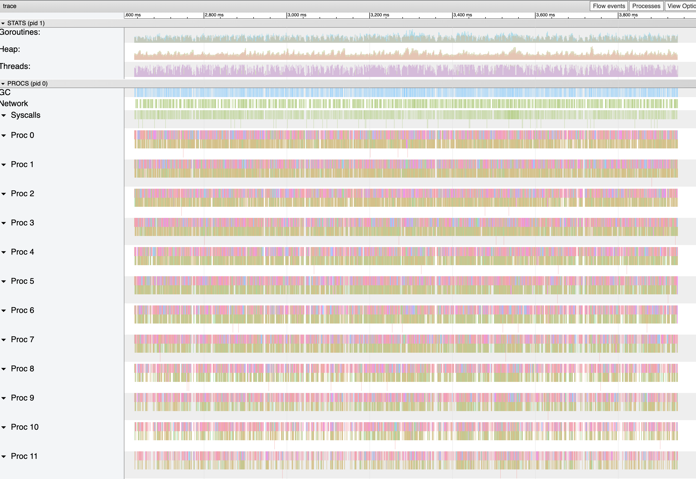
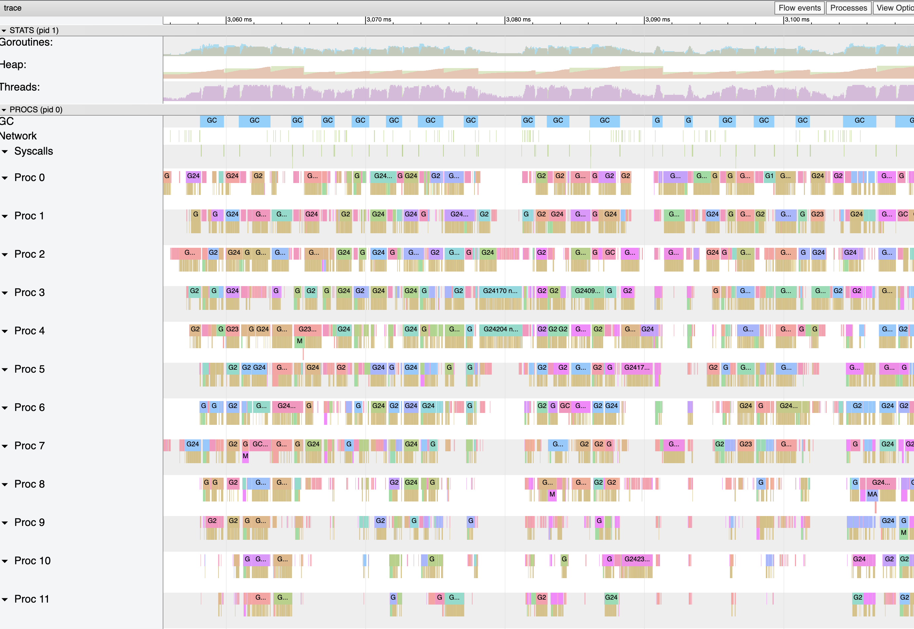

# Demo Flow - Step 3

[prev](../step2/README.md) | [next](../step4/README.md)

## Use the execution tracer

Run the benchmark and collect the execution trace
1. In terminal 2 - run the benchmark
   ```
   wrk -t100 -d7s -c100 http://localhost:8000/file/test-1mb 
   ```
2. In terminal 3 - while benchmark is running, call the `/debug/pprof/trace` endpoint to collect the execution trace from the server for 5 seconds and save to a file, e.g. named `trace.out`
   ```
   curl http://localhost:8000/debug/pprof/trace?seconds=5 -o trace.out
   ```
3. In terminal 3 - run the `trace` tool with the trace data and open the browser with the results
   ```
   go tool trace trace.out
   ```

Or do all in one command:
```
wrk -t100 -d7s -c100 http://localhost:8000/file/test-1mb & sleep 1 && curl http://localhost:8000/debug/pprof/trace?seconds=5 -o trace.out && go tool trace trace.out
```

### Execution Trace View

The trace data is quite large, so the trace tool splits it to several chunks.
Let's view one of the middle chunks:



From a high-level view, it seems there are many GC events and the heap has a lot of noise. Let's zoom in...



There are indeed quite often GC events and there are many gaps between scheduled functions in the processors. The heap's chainsaw peaks in the graph fit the GC events.

There is a lot of pressure on the GC, let's see how we can detect the cause.

----

Continue to [step 4](../step4/README.md) to investigate the heap.