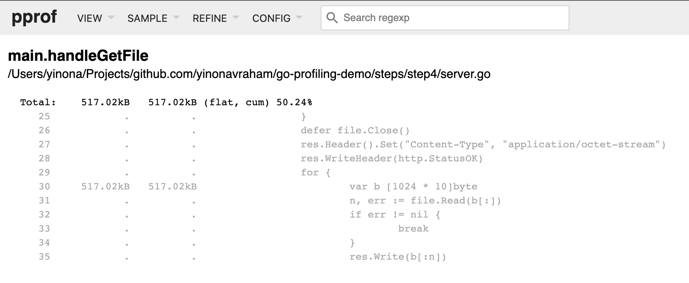
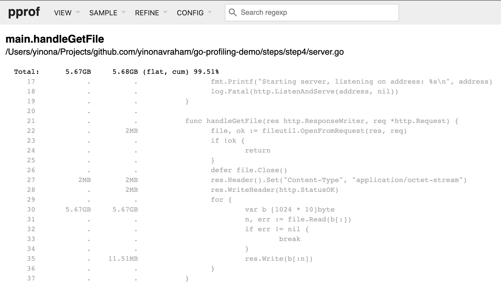

# Demo Flow - Step 4

[prev](../step3/README.md) | [next](../step5/README.md)

## Collect memory profile

Run the benchmark and collect the memory profile
1. In terminal 2 - run the benchmark
   ```
   wrk -t100 -d7s -c100 http://localhost:8000/file/test-1mb 
   ```
2. In terminal 3 - while benchmark is running, run the `pprof` tool to collect memory (heap) samples from the server for 5 seconds and open the browser with the results
   ```
   go tool pprof -http : http://localhost:8000/debug/pprof/heap?seconds=5
   ```
Or do both in one command:
```
wrk -t100 -d7s -c100 http://localhost:8000/file/test-1mb & sleep 1 && go tool pprof -http : http://localhost:8000/debug/pprof/heap?seconds=5
```

We'll skip the graph view and jump straight to the source view.

### Source View

The source view shows where the most memory is being allocated and used.
There are two main types of samples:
* `inuse` - heap memory in use
* `alloc` - total heap memory allocated since the process started

**In Use**



**Allocated**



In both views we can see right away the primary suspect - the byte array for the read buffer. The array is being allocated in each iteration.

----

Continue to [step 5](../step5/README.md) to see improvement attempt #1.