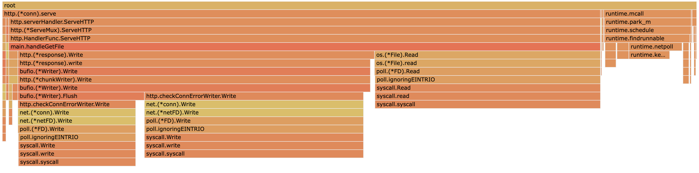
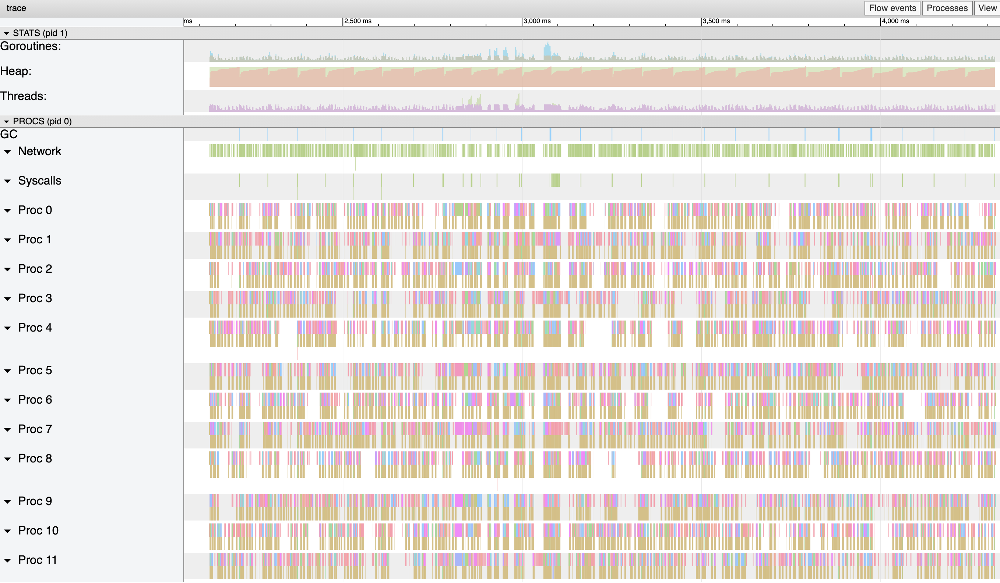

# Demo Flow - Step 5

[prev](../step4/README.md) | [next](../step6/README.md)

## Improvement attempt #1

Instead of allocating the byte array in each iteration, let's allocate it right before the `for` loop.

Change from:
```go
for {
	var b [1024 * 10]byte
```
To:
```go
var b [1024 * 10]byte
for {
```

Running the benchmark again - the throughput improved from `~1,100 req/sec` to `1,200 req/sec`.

### Flame Graph

Looking at the flame graph, GC seems to take less CPU time, but scheduling is still taking CPU time.



### Execution Trace

Looking at the execution trace, it matches what was visible in the graph view. There are less GC event, less noise in the heap graph, but there are still gaps in the scheduling.



----

Continue to [step 6](../step6/README.md) to the next improvement attempt.