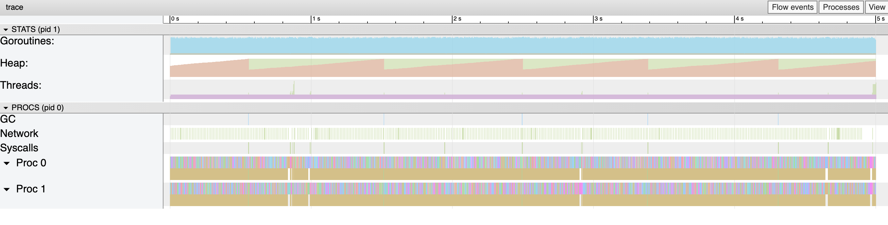

# Demo Flow - Step 7

[prev](../step6/README.md) | [next](../step8/README.md)

## Improvement attempt #3

The current blockage seems to be the Go scheduler. 
It is too busy scheduling Go routines on the available processors.

This attempt is to try and see what is the effect of reducing the scheduling effort, specifically by limiting the number of processors (i.e. cores) the scheduler will use.

Kill the demo server and this time run it, limited to `2` processors:
```
GOMAXPROCS=2 go run .
```

Running the benchmark again - the throughput improves. Before it was `~1,100 req/sec`, now it is `~1,500 req/sec`.
Looking in the execution trace, it is very clear there are no gaps in the scheduling of the Go routines over the 2 available processors.



Zoom in - there are no visible gaps.


----

Continue to [step 8](../step8/README.md), see how to add a custom profile.