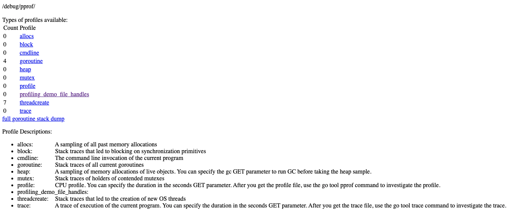
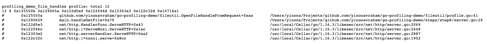
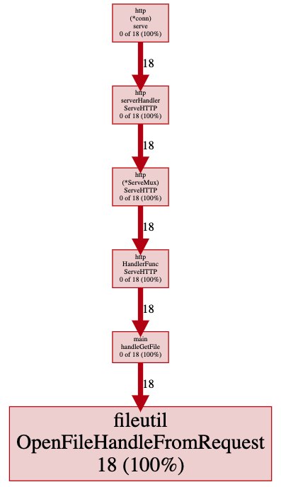

# Demo Flow - Step 8

[prev](../step7/README.md) | [next](../step9/README.md)

## Add custom profile

There is an option to add a custom profile and expose it as part of the `pprof` package.
In this demo we will profile the files opened by the requests.

1. Add the custom profile. Note- profile names must be unique, otherwise it panics.
   ```go
   var profile *pprof.Profile
   
   func init() {
   	const profile_name = "profiling_demo_file_handles"
   	profile = pprof.Lookup(profile_name)
   	if profile == nil {
   		profile = pprof.NewProfile(profile_name)
   	}
   }
   ```
2. `Add` the profiled object to the profile, `Remove` once it is released.  
   Here we use a `FileHandle` to wrap the monitored file and encapsulate it.
   ```go
   type FileHandle struct {
   	file *os.File
   }

   func (h *FileHandle) Close() error {
   	profile.Remove(h)
   	return h.file.Close()
   }
   ```
   Add a `OpenFileHandleFromRequest` function that is responsible for adding the handle:
   ```go
   fileHandle = &FileHandle{
   	file: file,
   }
   profile.Add(fileHandle, 1)
   ```
3. Use the new `OpenFileHandleFromRequest` function in the `handleGetFile`

The custom profile is now available under the `/debug/pprof` endpoint



Browsing to the custom profile page while benchmark is running - the data is shown



And it can also be used with the pprof tool, directing it to the custom profile page. For example (in one line):
```
wrk -t100 -d7s -c100 http://localhost:8000/file/test-1mb & sleep 3 && go tool pprof -http : http://localhost:8000/debug/pprof/profiling_demo_file_handles
```
Results with:



----

Continue to [step 9](../step9/README.md) to see how to expose other values.