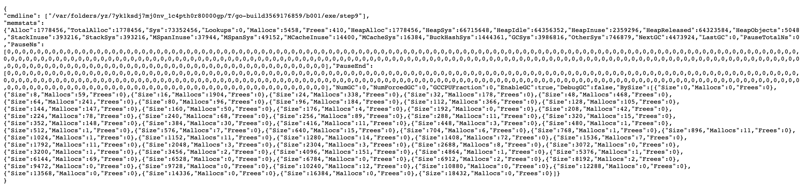
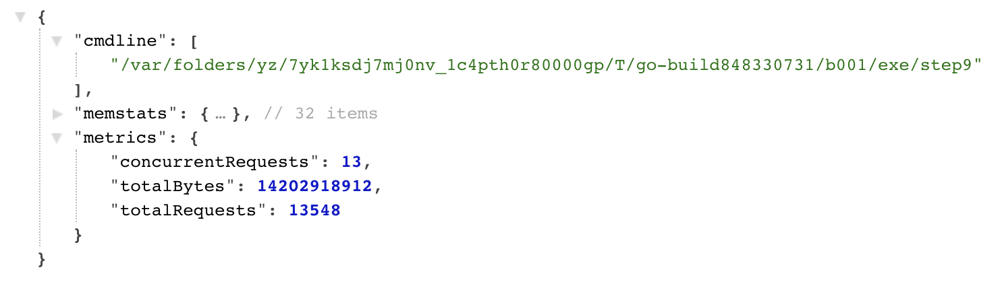

# Demo Flow - Step 9

[prev](../step8/README.md) |

## Expose operational values

There is an option to expose operational values publicly.

Import the [`expvar`](https://pkg.go.dev/expvar) package
```go
import _ "expvar"
```

Restart the demo server and browse to `http://localhost:8000/debug/vars`.



## Add custom exposed variable

Adding custom operational values is quite easy.

1. Import the `expvar` package, not anonymously
2. Define variables for the operational values
3. Add the custom variables to the exposed values

----

In this demo we will monitor the following information: 
* Number of concurrent requests
* Total number of requests
* Total bytes read

Define the exposed variables:
```go
var concurrentRequests expvar.Int
var totalRequests expvar.Int
var totalBytes expvar.Int
```

Publish a map variable with the metrics values:
```go
metrics := expvar.NewMap("metrics")
metrics.Set("concurrentRequests", &concurrentRequests)
metrics.Set("totalRequests", &totalRequests)
metrics.Set("totalBytes", &totalBytes)
```

On every request, add to request metrics counters:
```go
totalRequests.Add(1)
concurrentRequests.Add(1)
defer concurrentRequests.Add(-1)
```

Every time bytes are read - count the bytee
```go
totalBytes.Add(int64(n))
```

(see modified source code in [server.go](server.go))

----

Run the demo server again, run the benchmark and refresh the `/debug/vars` page - the custom operational information is available.



----

And we're done!